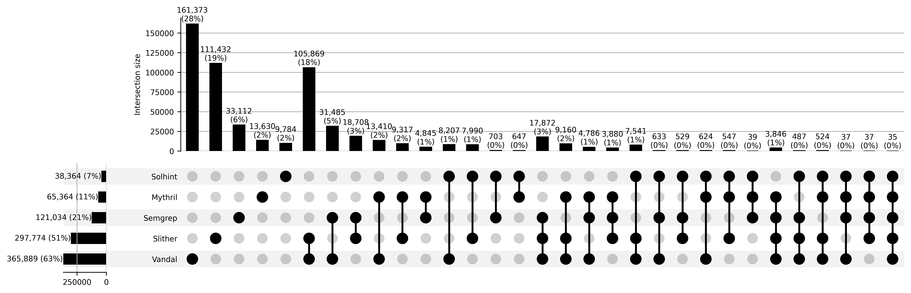

# RQ3 Experiment

## Average Jaccard Similarity Coefficient

Workdir: `./overlap/jaccard_similarity`

`./overlap/jaccard_similarity/RQ3_j2-j6.ipynb` outputs J2 to J6.

## UpSet diagram

Workdir: `./overlap/upset_data`

`./overlap/upset_data/RQ3_upset_diagram.ipynb` outputs the UpSet diagrams for five high-risk vulnerabilities.

### REN

| Tools | Approach | Level | Detection Rules |
| --------| --- | ---- | ------- |
| [Mythril](https://github.com/muellerberndt/smashing-smart-contracts/blob/master/smashing-smart-contracts-1of1.pdf) | Symbolic Execution | Bytecode	|If an external call to an untrusted address is detected, analyze the control flow graph for possible state changes that occur after the call returns.  |
| [Semgrep](https://github.com/Decurity/semgrep-smart-contracts?tab=readme-ov-file) | Pattern Matching | Source Code	|1. Function `borrowFresh()` in Compound performs state update after `doTransferOut()`.  2. ERC677 `callAfterTransfer()` / ERC777 `tokensReceived()` / ERC721 `onERC721Received()`.  3. `getRate()`/`getPoolTokens()`/`get_virtual_price()` call on a Balancer pool is not protected from the read-only reentrancy. |
| [Slither](https://dl.acm.org/doi/10.1109/wetseb.2019.00008) | Intermediate Representation Matching | Source Code | A state variable is changed only after an external call (the build-in function `call()`). |
| [Solhint](https://github.com/protofire/solhint/blob/develop/docs/rules/security/reentrancy.md) | Pattern Matching | Source Code	|Avoid state changes after transfer.  |
| [Vandal](https://arxiv.org/abs/1809.03981) | Intermediate Representation Matching | Bytecode	|A call is flagged as reentrant if it forwards sufficient gas and is not protected by a mutex.|

#### Tool combination recommendation

{Vandal}

<!-- 
**R1.** Mythril and Slither apply the same general rule (state change after call), which does not account for reentrancy protection.

**R2.** Vandal excludes false positives related to gas checks and mutex protection based on the general rules above.

**R3.** Semgrep targets specific patterns based on actual DeFi exploits.

**R4.** Solhint identifies state changes after the built-in  `send()` and `transfer` functions, but this is an incorrect rule, as these functions are safe due to their gas limitations.

As shown in the UpSet diagram, the six column indicates the greatest overlap between Slither and Vandal, as both use the same intermediate representation matching approach, and their rules are partially similar (**R1**&**R2**). 

Moreover, as seen in the ten column, there is minimal overlap between Slither and Mythril. Although both tools apply the same general rule, Mythril utilizes a symbolic execution approach that faces path explosion issues, limiting its detection capabilities.

The seventh and eighth columns show overlap between Semgrep and Vandal, as well as between Semgrep and Slither, which reflects the fact that the general rule covers some specific rules (**C1**&**R2**&**R3**) to some extent. 

The columns twelve through fifteen illustrate that Solhint has little overlap with other tools (**R4**), due to its incorrect rule. -->

### USI

| Tools | Approach | Level | Detection Rules |
| --------| --- | ---- | ------- |
| [Mythril](https://github.com/muellerberndt/smashing-smart-contracts/blob/master/smashing-smart-contracts-1of1.pdf) | Symbolic Execution | Bytecode	| Any sender can trigger execution of the SELFDESTRUCT instruction to destroy this contract account and withdraw its balance to an arbitrary address.|
| [Semgrep](https://github.com/Decurity/semgrep-smart-contracts?tab=readme-ov-file) | Pattern Matching | Source Code	| Contract can be destructed by anyone. |
| [Slither](https://github.com/crytic/slither/wiki/Detector-Documentation) | Intermediate Representation Matching | Source Code | Unprotected call to a function executing `selfdestruct`/`suicide`.|
| [VeriSmart](https://arxiv.org/abs/1908.11227) | Symbolic Analysis | Source Code |Given a statement that deactivates contracts, we report a suicidal vulnerability if the statement can be executed by untrusted users.|
| [Ethainter](https://doi.org/10.1145/3385412.3385990) | Symbolic Analysis | Bytecode |  Accessible selfdestruct vulnerability is more commonly encountered in combination with a tainted guard.|
| [Vandal](https://arxiv.org/abs/1809.03981) |Intermediate Representation Matching | Bytecode	| Any code path leading to a selfdestruct instruction, that can be executed by an arbitrary caller.|

#### Tool combination recommendation

{Ethainter, Mythril, Vandal, Verismart}

### TXO

| Tools | Approach | Level | Detection Rules |
| --------| --- | ---- | ------- |
| [Mythril](https://github.com/muellerberndt/smashing-smart-contracts/blob/master/smashing-smart-contracts-1of1.pdf) | Symbolic Execution | Bytecode	| Currently we just point out the usage of `tx.origin`. We should check whether it is being used in some sort of authorization.(like `require()`)|
| [SmartCheck](https://doi.org/10.1145/3194113.3194115) | Intermediate Representation Matching  | Source Code | The pattern detects the environmental variable `tx.origin`.|
| [Slither](https://github.com/crytic/slither/wiki/Detector-Documentation) | Intermediate Representation Matching | Source Code | `tx.origin`-based protection can be abused by a malicious contract if a legitimate user interacts with the malicious contract.|
| [Solhint](https://github.com/protofire/solhint/blob/develop/docs/rules/security/avoid-tx-origin.md) | Pattern Matching | Source Code	| Avoid to use `tx.origin`.|
| [Vandal](https://arxiv.org/abs/1809.03981) |Intermediate Representation Matching | Bytecode	| Checking that an origin instruction exists, and that its result is used in some other potentially sensitive operation such as a conditional or a write to storage.|
| [SolidityCheck](https://arxiv.org/abs/1911.09425) | Intermediate Representation Matching  | Source Code | Using `tx.origin` for authentication.|

#### Tool combination recommendation

{Solhint}

### UEW

| Tools | Approach | Level | Detection Rules |
| --------| --- | ---- | ------- |
| [Mythril](https://github.com/muellerberndt/smashing-smart-contracts/blob/master/smashing-smart-contracts-1of1.pdf) | Symbolic Execution | Bytecode	| An issue is reported if there is a valid end state where the attacker has successfully increased their Ether balance. |
| [Semgrep](https://github.com/Decurity/semgrep-smart-contracts?tab=readme-ov-file) | Pattern Matching | Source Code	| Function `sweepToken` is allowed to be called by anyone.|
| [Slither](https://github.com/crytic/slither/wiki/Detector-Documentation) | Intermediate Representation Matching | Source Code | Unprotected call to a function sending Ether to an arbitrary address. |
| [VeriSmart](https://arxiv.org/abs/1908.11227) | Symbolic Analysis | Source Code | Given a statement that sends Ethers to accounts, we report a leaking vulnerability if the contract leaks Ethers to an untrusted user and the amount of the leaked Ethers is greater than the amount of Ethers sent from the untrusted user. |
| [Ethainter](https://doi.org/10.1145/3385412.3385990) | Symbolic Analysis | Bytecode | With a tainted selfdestruct vulnerability, the receiving address of the funds can be controlled by any user of the contract. |
| [Vandal](https://arxiv.org/abs/1809.03981) |Intermediate Representation Matching | Bytecode	| If an arbitrary caller can force it to transfer Ether, and can manipulate the address to which that Ether is transferred. |

#### Tool combination recommendation

{Semgrep, Mythril, Ethainter, Vandal, Slither, VeriSmart}

### IOU

| Tools | Approach | Level | Detection Rules |
| --------| --- | ---- | ------- |
| [Mythril](https://github.com/muellerberndt/smashing-smart-contracts/blob/master/smashing-smart-contracts-1of1.pdf) | Symbolic Execution | Bytecode	| For every SUB instruction, check if there's a possible state where op1 > op0. For every ADD, MUL instruction, check if  there's a possible state where op1 + op0 > 2^32 - 1.|
| [SmartCheck](https://doi.org/10.1145/3194113.3194115) | Intermediate Representation Matching  | Source Code | The pattern detects arithmetic operations +, -, *, which are not inside a conditional statement. This rule was temporarily muted for testing due to a high false positive rate. |
| [Semgrep](https://github.com/Decurity/semgrep-smart-contracts?tab=readme-ov-file) | Pattern Matching | Source Code	| basic-arithmetic-underflow：Possible arithmetic underflow. |
| [MadMax](https://doi.org/10.1145/3276486) | Intermediate Representation Matching  | Bytecode | Loop overflows are conservatively asserted to be likely if the induction variable is cast to a short integer or ideally one byte. The loop has to be dynamically bound to be vulnerable, i.e., the number of iterations is determined by some run-time value. |
| [VeriSmart](https://arxiv.org/abs/1908.11227) | Symbolic Analysis | Source Code | when we want to check whether a contract contains integer overflow vulnerabilities, given an assignment x := y+z, we assume an assertion assert(y+z >= y) is inserted right before the assignment. |

#### Tool combination recommendation

{Verismart, Madmax, Semgrep}