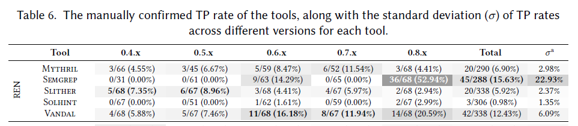
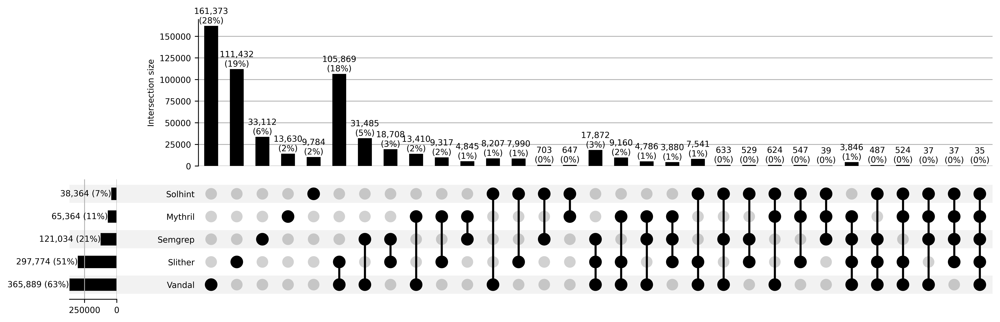

# MajorIssue-1(Reviewer1&2): In-depth analysis of the detection results.

## SWC-107 reentrancy

| Tools | Approach | Level | Detection Rules |
| --------| --- | ---- | ------- |
| Mythril [] | Symbolic Execution | Bytecode	|If an external call to an untrusted address is detected, analyze the control flow graph for possible state changes that occur after the call returns.  |
| [Semgrep](https://github.com/Decurity/semgrep-smart-contracts?tab=readme-ov-file) | Pattern Matching | Source Code	|1. Function `borrowFresh()` in Compound performs state update after `doTransferOut()`.  2. ERC677 `callAfterTransfer()` / ERC777 `tokensReceived()` / ERC721 `onERC721Received()`.  3. `getRate()`/`getPoolTokens()`/`get_virtual_price()` call on a Balancer pool is not protected from the read-only reentrancy. |
| Slither [] | Intermediate Representation Matching | Source Code | A state variable is changed only after an external call (the build-in function `call()`). |
| [Solhint](https://github.com/protofire/solhint/blob/develop/docs/rules/security/reentrancy.md) | Pattern Matching | Source Code	|Avoid state changes after transfer.  |
| Vandal [] | Intermediate Representation Matching | Bytecode	|A call is flagged as reentrant if it forwards sufficient gas and is not protected by a mutex.|

### Comparision

**C1.** Mythril and Slither apply the same general rule (state change after call), which does not account for reentrancy protection.

**C2.** Vandal excludes false positives related to gas checks and mutex protection based on the general rules above.

**C3.** Semgrep targets specific patterns based on actual DeFi exploits.

**C4.** Solhint identifies state changes after the built-in  `send()` and `transfer` functions, but this is an incorrect rule, as these functions are safe due to their gas limitations.

### RQ2 (TP Rate Results)

As shown in the total column of Table 6, Semgrep exhibits the highest true positive rate (TPR), as it targets specific DeFi exploits (**C3**) rather than general reentrancy. Vandal has the second-highest TPR, as it identifies some vulnerability protection techniques (**C2**). Mythril and Slither have similarly low TPRs, as their general rules do not account for any vulnerability protections (**C1**). Solhint’s TPR is nearly zero due to incorrect rules (**C4**).

### RQ3 (Overlap Results)

As shown in the UpSet diagram, the six column indicates the greatest overlap between Slither and Vandal, as both use the same intermediate representation matching approach, and their rules are partially similar (**C1**&**C2**). 

Moreover, as seen in the ten column, there is minimal overlap between Slither and Mythril. Although both tools apply the same general rule, Mythril utilizes a symbolic execution approach that faces path explosion issues, limiting its detection capabilities.

The seventh and eighth columns show overlap between Semgrep and Vandal, as well as between Semgrep and Slither, which reflects the fact that the general rule covers some specific rules (**C1**&**C2**&**C3**) to some extent. 

The columns twelve through fifteen illustrate that Solhint has little overlap with other tools (**C4**), due to its incorrect rule.

## SWC-106 Unprotected SELFDESTRUCT Instruction

## SWC-115 Authorization through tx.origin

## SWC-105 Unprotected Ether Withdrawal

## SWC-101 Integer Overflow and Underflow